 
## 查看主页获取源码

### 一、作品包含

源码+数据库+设计文档万字+PPT+全套环境和工具资源+部署教程

### 二、项目技术

前端技术：Html、Css、Js、Vue、Element-ui

数据库：MySQL

后端技术：Java、Spring Boot、MyBatis

  

### 三、运行环境

开发工具：IDEA/eclipse

数据库：MySQL5.7

数据库管理工具：Navicat10以上版本

环境配置软件： JDK1.8+Maven3.6.3

前端Nodejs：14

### 四、项目介绍
项目编号：springbootA151

付费自习室管理系统在现代都市快节奏的学习和工作环境中应运而生，它基于对共享经济理念的深入理解和对高效学习空间需求的准确把握，通过技术手段实现自习室资源的合理分配、使用监控和便捷支付，旨在为用户提供一个安静、专注、舒适的学习环境，同时帮助自习室经营者提高管理效率，降低运营成本，实现资源最大化利用。

前台用户功能：浏览首页、自习室准则、自习室、公告信息、留言反馈、后台管理和个人中心。

后台分为管理员和用户
管理员的功能：系统首页、个人中心、用户管理、自习室准则管理、自习室管理、自习计划管理、留言反馈、系统管理、订单管理。
用户的功能：系统首页、个人中心、自习计划管理。

### 五、运行截图

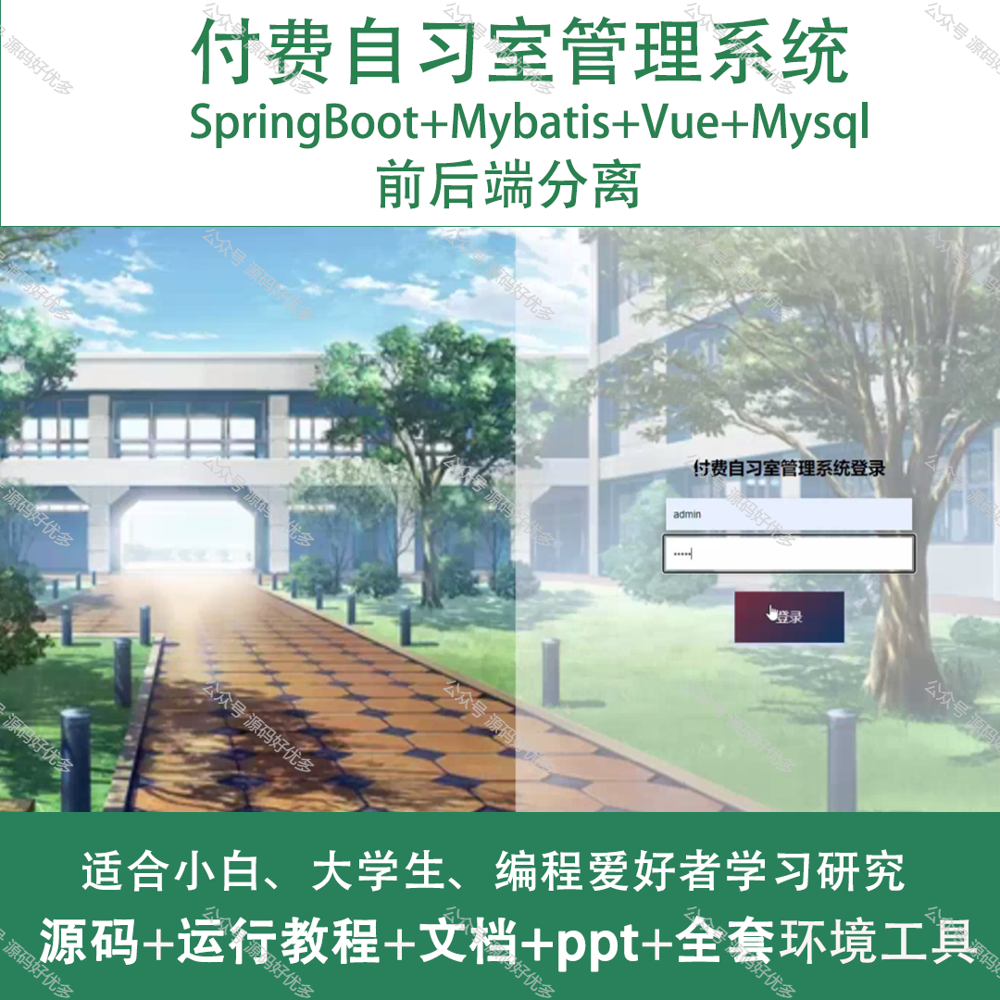
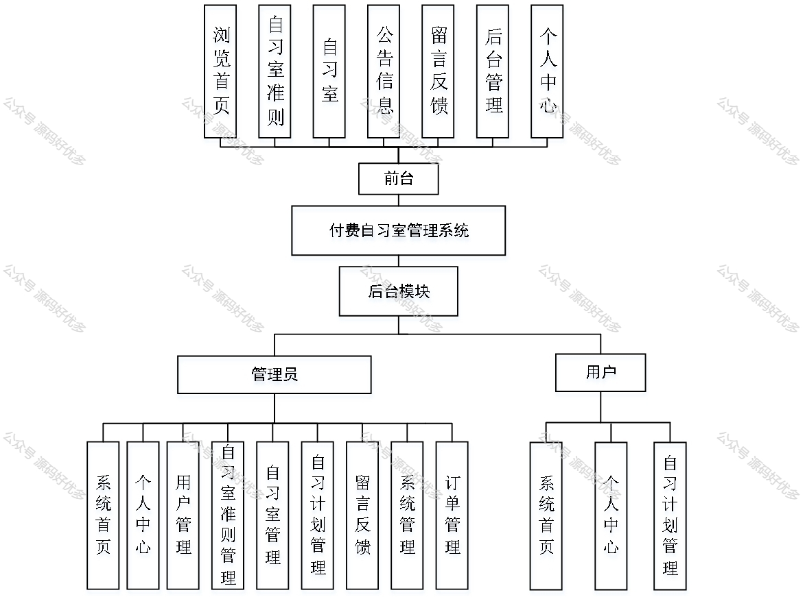
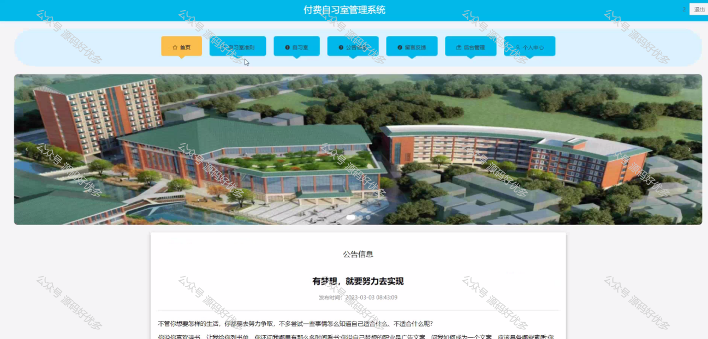
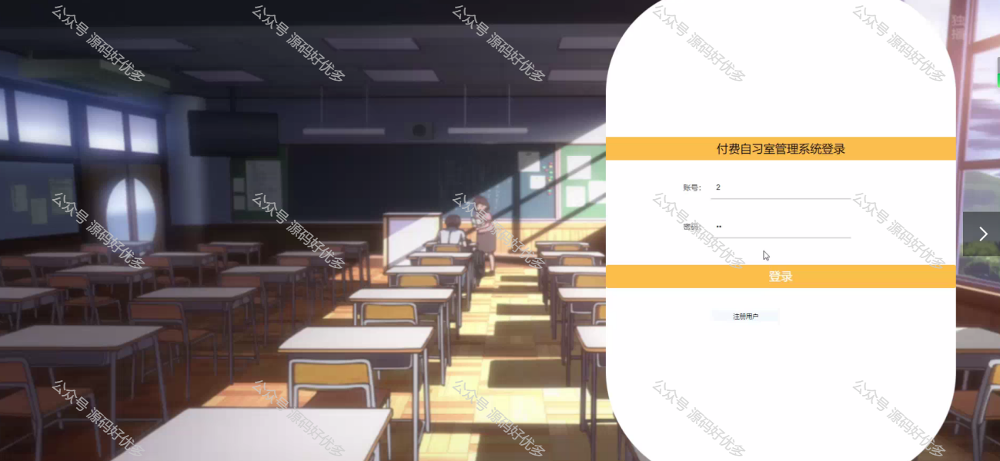
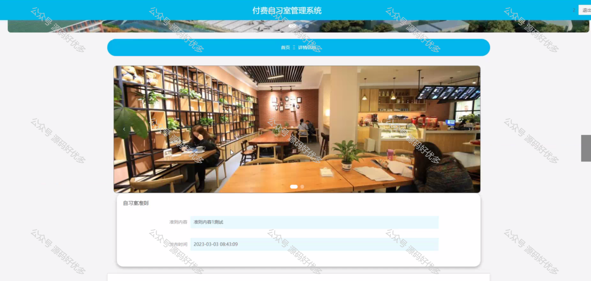
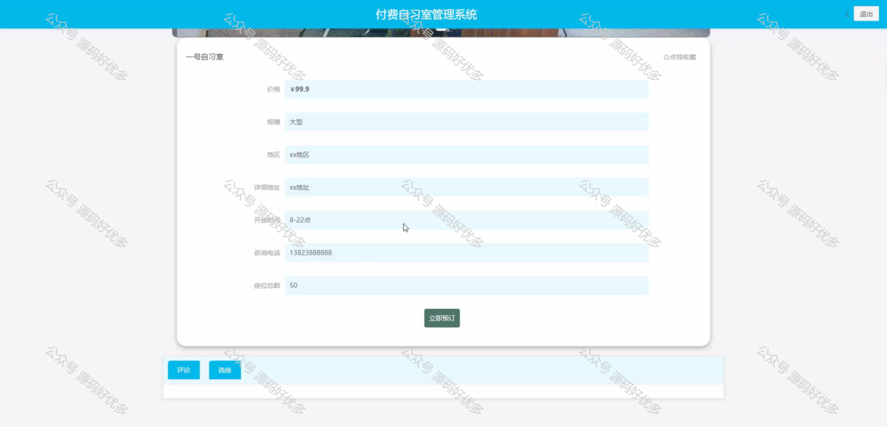
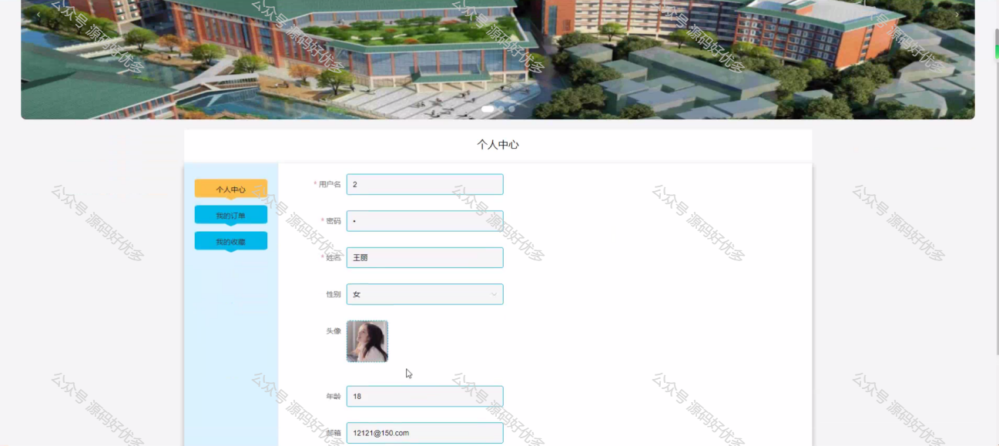
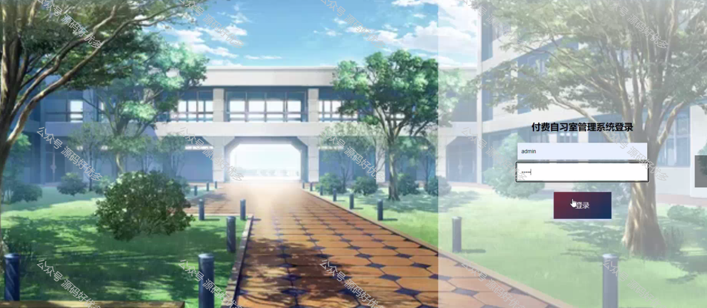
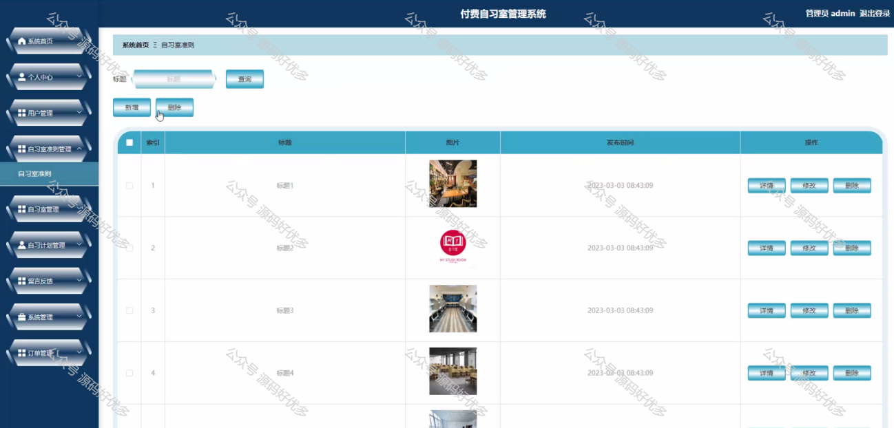
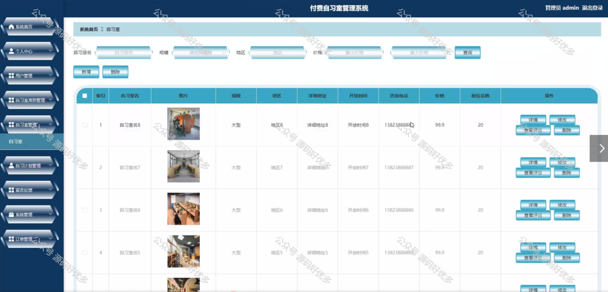
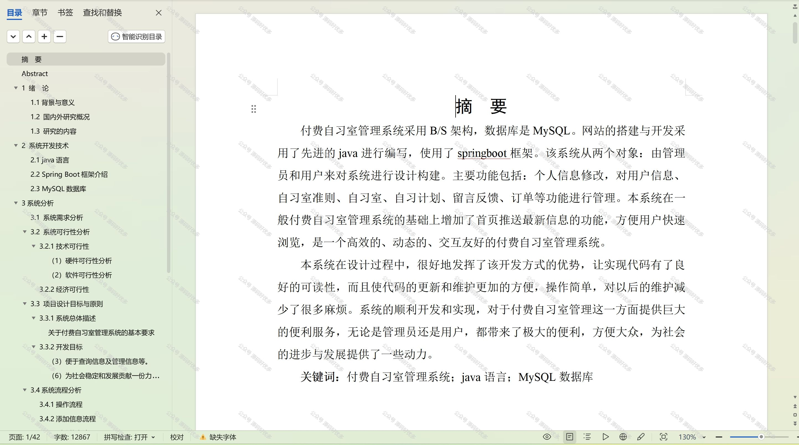

  

